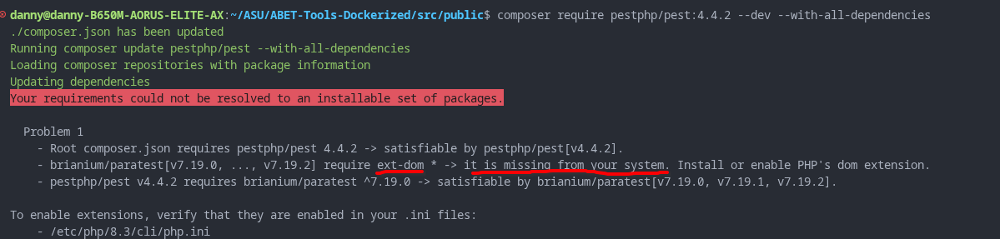

# The Main Application for ABET-Tools


[](https://github.com/hoang-danny05/ABET-Tools-Dockerized/actions/workflows/test.yml)

<!--
   
-->

<!-- fancy icons from shields.io -->
<!---->

- [The Main Application for ABET-Tools](#the-main-application-for-abet-tools)
  - [Overview](#overview)
  - [Getting Started](#getting-started)
  - [ABET private key setup](#abet-private-key-setup)
  - [Docker Installs](#docker-installs)
    - [Linux](#linux)
    - [Windows](#windows)
  - [Important Files](#important-files)
    - [`.env` files](#env-files)
    - [`.htaccess` files](#htaccess-files)
  - [Managing PHP dependencies with Composer](#managing-php-dependencies-with-composer)
    - [Installing Composer](#installing-composer)
    - [Using Composer](#using-composer)
    - [Composer Install (the command)](#composer-install-the-command)
  - [Database development](#database-development)
    - [Using Migrations](#using-migrations)
  - [Pulling from the server](#pulling-from-the-server)
  - [More information](#more-information)

## Overview

This is our application, containerized for easier development. Included are containers for:

- The PHP/Apache server
- Canvas Formatting APIs
- The report generation API
- The Canvas Extraction API
- The MySQL database (to simulate the real one)
- PHPMyAdmin for easy database administration
- A selenium container for E2E testing

## Getting Started

This requires:

- **Docker engine** AND **docker compose** to be installed. [Docker Install](#docker-installs)
- **CPanel** This also requires you to have the cPanel server private keys added. [ABET Private Key](#abet-private-key-setup)
- A bash command line. (a given)

Once that's done, you can run these commands to view the application

1) cd into `docker/` and create a `.env`. `env.demo` is a template file that is suitable for development.
2) within `docker/`, run `docker compose up --build`
3) you can visit [localhost port 8080](https://localhost:8080) to see the interface
4) you can visit [localhost port 8081](https://localhost:8081) to use phpMyAdmin (useful to see database state)

> [!NOTE]  
> Env files are how we configure the containers to run
> differently on your local machine and on the server.
> Using the env files correctly will ensure that your
> code works as intended on the server.
>
> [More information about the ENV files are available in this section](#env-files).

## ABET private key setup

Using the CPanel

1) download abet ssh key from the CPanel
2) Set correct permissions: `chmod 600 abet`
3) Move it to a convenient spot. usually `.ssh/`
4) `eval "$(ssh-agent -s)"`
5) `ssh-add $PATH_TO_ABET_PRIVATE_KEY`
6) Use the ABET ssh key password in the discord.

## Docker Installs

You should follow official Docker installation. You got this. Installing Docker Desktop is the easiest way, regardless of OS.

### Linux

[Docker engine](https://docs.docker.com/engine/install)

[Docker compose](https://docs.docker.com/compose/install)

### Windows

[Docker desktop](https://docs.docker.com/desktop/setup/install/windows-install/) (Installs both!)

## Important Files

everything in `docker/` refers to the current containers that we have in the application. If we want more, we should add a folder with the container name, and a `docker-compose.yaml`.

**app container**: a php-apache container that runs both php and apache. Apache config is in `docker/apache2`, but you need to copy this from the server.

**mysql container**: the container containing the mysql instance and whose database is in `./docker/mysql/mysql_data`

if we want to integrate the python file, we can easily create a fastapi container in the docker-compose.

The rest of the project organization info is [HERE in the docs](docs/project-organization.md)

### `.env` files

This is the MOST important concept of configuration in the project. On first setup, you probably run `cp env.demo .env`, but you don't really know what that does. `docker/.env` stores all of the filled environment variables, and is used by `docker-compose.yml` which then may set the environment variables of the containers to those values.

`.env` stores ALL of our secret keys, but also our configuratoin information. Changing .env will change how the containers are built. I made `env.demo` with the purpose of easy setup, but these values should NEVER be exposed or used in the real server.

> [!NOTE]  
> The project usually has a second .env file called prod.env
> that is meant to only run on the server and has credentials
> that may never be exposed. You only interact with this file if
> you are deploying the application or messing with the server.
>
> [More information about .env files](docs/env.md)
>
> [More information about project deployment](docs/deployment.md)

### `.htaccess` files

These are apache configuration files that exist only within the `src/public` directory. They are local and apply to the current directory and all subdirectories. They work hieracically: htaccess files in subdirectories overwrite ones in parent directories.

We use .htaccess files to rewrite important paths and to set apache settings specific to our project only. **DO NOT** try to update the server's actual apache's config, it will affect EVERY project hosted by this server.

[Click here for official docs on the file type](https://httpd.apache.org/docs/current/howto/htaccess.html)

## Managing PHP dependencies with Composer

### Installing Composer

To use composer on your system, you need PHP8.3+ installed.
(The server has php8.3 installed)
To install everything, I did this:

```bash
sudo apt install php8.3 && \
sudo apt install php8.3-xml && \
sudo apt install php8.3-mysql && \
RUN curl -sS https://getcomposer.org/installer | php -- --install-dir=/usr/bin --filename=composer
```

### Using Composer

If the last command was successful, you now have PHP and composer installed on your system!
Now, you can install any composer package you want!

```bash
cd src/public
composer require pestphp/pest --dev --with-all-dependencies 
# FORMAT: composer require PACKAGE_NAME:PACKAGE_VERSION --with-all-dependencies
# --dev specifies that Pest (testing) is only for development (not deployment)
```

> [!NOTE]
> You might get an error when trying to require your package.
> This is due to uninstalled PHP extensions.
>
> If this happens,
> `Require` the latest version of the package, and then check composer's output.
>
> 
>
> In this example, ext-dom is not installed.
> Installing php8.3-xml fixed the errors for me.
> I trust that you can install this yourself.

All you need to do now is to require autoload.php in your php files

```php
# Note that this is the path RELATIVE to the current file. 
require __DIR__ . '/vendor/autoload.php'; 
```

[Official Composer Usage Docs](https://getcomposer.org/doc/01-basic-usage.md#autoloading)

### Composer Install (the command)

Let's say some file requires autoload and
you haven't installed the composer files on your system.
You can fix this by running:

```bash
cd src/abet_private
composer install
```

This simply reads the dependencies in composer.json
and installs them in the vendor/ folder.

## Database development

If you're working on the database, the most important file
in the project for you is `docker/mysql/init.sql`, as it
defines all of the database tables that you will interface with.

> [!IMPORTANT]  
> Restarting the `docker compose` contaienrs will NOT
> update the mySQL tables. This is because the mysql
> container is simply restarted, not built again.
>
> You can fix this by running the following commands:

within the `docker/` folder

```bash
docker compose down     # or docker-compse if you have that
docker compose up --build
```

### Using Migrations

Migrations are how we can set scripts so syncrhonize tables on your end with prod.
Please use this when altering tables. Otherwise, you will need to delete the tables manually and recreate them on the server. New tables added with `IF NOT NULL` can stay in init.sql, but you may make migrations for that too just to show off.

Installing dependencies

```bash
sudo apt install php8.3-cli
sudo apt install php8.3-xml
sudo apt install php8.3-mysql
sudo apt install composer
```

Install compser packages

```bash
cd src/abet_private
composer install
```

Generate migrations (will be in `src/abet_private/database/migrations`)
A new file with the dated version will appear.
The other migrations can be a template to show you how to implement a migration.

```bash
composer doctrine generate
```

This is how you test migrations:
Note that you need your mysql docker container up to test this.
Remove the `--dry-run` to actually run it.

```bash
compser doctrine migrate --dry-run
```

[Information on how to link to the database](docs/database_link.md)

## Pulling from the server

**NOTE:** `copy_from_server.bash` does not currently sync everything up, as we have not fully adopted this method. abet_private is copied into `src/abet_private/abet_private` and abet.asucapstonetools.com is copied into `src/public/abet.asucapstonetools.com`

1) git clone this repo.
2) cd into `scripts/` and run `copy_from_server.bash`
    - I hardcoded the server IP, so we might need to change this if the step doesn't work
    - The script also assumes you're in `scripts/`, else it will copy the files to who knows where.
3) git add, commit, and push your changes

## More information

More docs are located in the [docs directory](./docs/).

Even more information is found [in this master document.](https://docs.google.com/document/d/1mHOwIYyIZtg7FO8jtxTz9lPIuB3W9JVeVAR240YsTQA/edit?tab=t.88j2hx3zuwbr)
