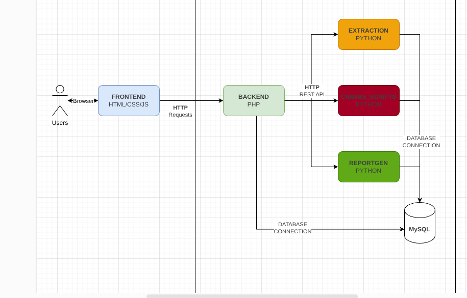

# Design Choices for the application

We chose to split up the project into many smaller parts to ensure that people don't step over each other's work.
Here, you can see separate components for each team and who is concerned with each. (Although it's a bit blurry the read one is CANVAS_SCRIPTS).

## Python Containers

We modularize this into 3 separate containers in the docker compose file. (Extraction, canvas_scripts, and reportgen). They all have FastAPI endpoints that let the backend request and do its job. Each of these containers take one directory in the `src/` root directory to make it simpler. Each of these containers have a FastAPI endpoint so our backend may communicate with these containers to execute their respective functions.

## The php_apache container

On the development side, we also have a php_apache container that serves as the apache server for everything. Since this is difficult to split up, both of these ends are stored in the php_apache container. This file uses two distinct `src/` directories instead of one. 

### Concerning Backend

First, you have `abet_private`, which holds important php library files, and also holds the packaged files in `vendor`. As the name implies, everything here is private to end users, only we can directly access implementations here. This is good to hold files that directly interface with the database or services if need be.

### Concerning Frontend

Then, you have the `public` directory which holds files that are directly served by apache. PHP files here should only be *endpoints* that the users access directly. NO sensitive files should be here.

Since these PHP files have burdensome size (having HTML, CSS, and JS), I recommend people to separate stuff to the `assets/` folder within the public directory. Linking css files here will allow you to reuse CSS to follow good programming principles, and will generally make your work easier to do.

## Database

Our current database design currently has a SINGLE sql file that has database changes. This was good for prototyping, but as we have multiple people work on the database file, it has been a burden to automatically delete tables that have been altered and to check which ones need to be run.

Therefore, we are using **migrations** which allow people to add their own changes to the database. It's a little more than just writing plain SQL, but hopefully it will let me automate deployment finally.

[Tutorial I used](https://www.youtube.com/watch?v=peXlH04Hecc)

## Symfony

Symfony has built-in security, ORM, and everything.
I'm using Symfony 7.4 which is compatible with our current PHP version.
It is also a LTS version, meaning it will be supported much longer than the most recent version (8.0).

Steps for docs:

1) Install [Symfony CLI](https://symfony.com/download)
2) add symfony cli to ~/.bashrc
   1) `export PATH="$HOME/.symfony5/bin:$PATH"`
   2) `source ~/.bashrc`
3) `symfony new symfony-test --version="7.4.*" --webapp`
4) 
