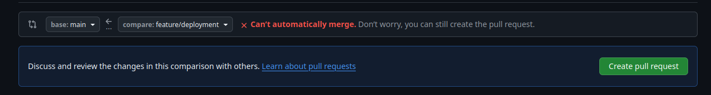

# The Intended Development Process

Hi! Good job for finding this! This will outline the intended development process for everyone in the project.
The general steps include:

1) General setup
2) Start Local Development
3) Push to Github and make a PR
4) Application staging
5) Deployment to the server

---

## General setup

Read this if you want a good idea on how to start developing on the project.
You might want to skip this if you already read the README.

### Installations

- [Docker](../README.md#docker-installs), but more specifically:
  - Docker Engine
  - Docker Compose

### Setting up an SSH Key

This section will allow you to follow the github commmands that I list.
It is VERY useful for interfacing with github generally.

[This video](https://www.youtube.com/watch?v=yVP3sYgd0bY) is very helpful.

I also recommend adding the ssh-add command in your `.bashrc` so it runs every time you start the terminal.
I cannot overstate how useful this will be to software dev.

```bash
# if you use ssh, i recommend it
git clone git@github.com:hoang-danny05/ABET-Tools-Dockerized.git
```

### Setting up your local development environment

Covered in the [main README](../README.md#getting-started) but here more thouroghly.

1) cd into `docker/` and create a `.env` file in that folder. `env.demo` is a format file that you can use. Please use this for development. [More info about .env files](../README.md#env-files)
2) within `docker/`, run `docker compose up --build`. This is a command that will be super helpful for you. It forces the containers to rebuild, even if they are already created, which is crucial if you change certain files like `docker/mysql/init.sql` and you want the containers to reflect the changes.
3) you can visit [localhost port 8080](https://localhost:8080) to see the interface
4) you can visit [localhost port 8081](https://localhost:8081) to use phpMyAdmin


> [!TIP]
> As long as you use the important .env variables for connecting to different
> containers, you should not worry about the implementaion on the server!
> The server builds based on an entirely different set of variable values,
> which correspond to how services on the server are laid out. 

### cPanel

The entire project is can be viewed on our shared cPanel server.
I cannot share the cPanel URL or login information.
If you're working with us, you should have the login information on the discord.

Important paths for us are:

`~/public_html/abet.asucapstonetools.com`

- stores the PHP that is served by the server

`~/abet_docker`

- our target for application deployment.
- Automated scripts target this directory

`~/abet_backup`

- backup for previous files that we made
- use for cases where you fear the worst

## Local Development

Make sure you're developing on your own branch. Even if you already made changes, it's not too late to branch off. Simply do:

```bash
# make your branch name unique!
# you can always change this later by executing this command again
git checkout -b <branch_name> 
```

Then, create incremental commits for every change you do!
The smaller and better labeled the commits are, the easier they are to track!

```bash
#make changes
git add src/abet_private
git commit -m "changed library files to support database connectoins"
git add src/public
git commit -m "synced the faculty forms with the database so filling it out reflects on the database"
```

## Push to Github and make a PR

Once you've got step 2 down, this should come easily.
Pushing to github simply allows us to see your changes.
It is unobtrusive and shows that you've been doing work.
I suggest you do it as often as possible.

```bash
# only if you're unsure what branch you're using:
git branch
# the actual operation
git push origin <branch_name>
```

Pushing is great, but once you finish a feature, you can create a Pull Request (PR).
To create a new PR, go to [the github](https://github.com/hoang-danny05/ABET-Tools-Dockerized/pulls).
Click the "New Pull Request" button.



You should select compare as the branch you are working on.
Don't worry if it says you can't automatically merge, you can create it anyways.

If it can't automatically merge, there is a merge conflict.
Check the code, and it will ask you which changes you want to keep.
If you understand the code, you will be able to do this by yourself.
Otherwise, you may need help from the other parties to figure out what to keep.

A Pull request can be opened at any time and resolved at any other time.

## Application staging

Staging is in a WIP state at the moment. It is meant
to simulate how deployment on the server will look like, on 
your local machine. 

> [!IMPORTANT]  
> This depends on the fact that you are using
> the production environment variables. Please
> copy the production .env file into your system
> and save your current .env file. somewhere else.
>
> Useful scripts for this are in `scripts/` (woah!!) 

```bash
docker compose -f docker-compose-staging.yml
```

## Deployment to the server

> [!CAUTION]  
> The steps here can permanently affect the state of the
> server. Please exercise caution.
> Make sure you know what each script does before doing it.
> A backup directory on the server at `~/abet_backup` exists
> if you're not confident in yourself.
>
> Good luck!

The main script I use for deployment is `scripts/deployment/deploy.bash`.

It assumes you:

- Have a server SSH key already added.
- Have a copy of the server's .env file in `docker/prod.env`.
- Have a stable, working version of code.

> [!TIP]
> `scripts/deployment/copy_from_server.bash` is a really useful template
> file for copying files directly from the server (like if you wanted
> to copy docker/.env on the server to docker/prod.env)

The script will copy your local copy of the files directly onto the server.
It will then restart and rebuild the docker containers. 

### Specific steps it takes
- It generates a `.htaccess` file with the production environment variables
- It shuts down the containers on the server
- It copies ONLY git-tracked files onto the server
- It copies sensitive .env and .htaccess files to the server
- It rebuilds and starts the containers based on `docker/docker-compose-prod.yml`

If any of these commands fail, the script will HALT and send a useful error message
to the user.

Note: If you changed any of the database tables, you will need to update them.
More info in [the deployment file](./deployment.md)